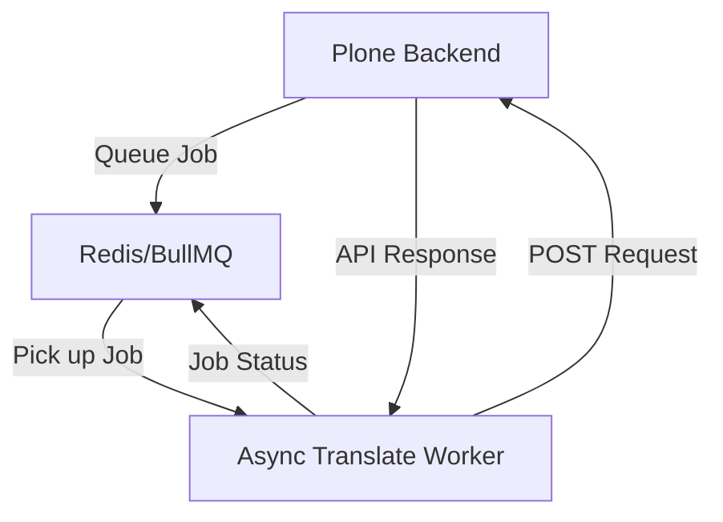

# Climate-ADAPT Async Translate Microservice

This microservice is a Node.js-based worker that manages the asynchronous translation workflow for Climate-ADAPT. It uses [BullMQ](https://bullmq.io/) and Redis to handle job queuing and state management.

## Role in the Ecosystem

The service acts as a middleware/orchestrator between the Plone backend and the external eTranslation service. Its primary purpose is to decouple long-running translation tasks from the main CMS operations, ensuring a responsive user experience.

## Tech Stack

- **Core**: Node.js, TypeScript
- **Queue Management**: BullMQ, IORedis
- **Web Framework**: Fastify
- **Communication**: node-fetch (interacting with Plone API)
- **Monitoring**: BullBoard, QueueDash

## Architecture

The service operates as a worker, picking up jobs from Redis and executing them by calling specific API views in Plone.

## Key Jobs and Workflow

The service handles three main types of jobs, defined in `src/jobs.ts`:

### 1. `call_etranslation`
- **Triggered by**: Plone when content needs translation.
- **Action**: Calls Plone's `@@call-etranslation` view.
- **Goal**: Triggers the actual SOAP call from Plone to the EC's eTranslation service.

### 2. `save_translated_html`
- **Triggered by**: Plone's `@@translate-callback` (after receiving content from EC).
- **Action**: Calls Plone's `@@save-etranslation` view.
- **Goal**: Ingests the translated HTML back into the Plone content types (converting it back to Volto blocks if necessary).

### 3. `sync_translated_paths`
- **Triggered by**: Plone when a canonical object is moved or renamed.
- **Action**: Calls Plone's `@@sync-translated-paths` view.
- **Goal**: Ensures that all translation objects are moved to the corresponding new paths.

## Monitoring and UI

The service provides two interfaces for monitoring:

- **BullBoard**: Accessible at `/ui`. Provides a detailed view of queues, job statuses, and allows for retrying failed jobs.
- **QueueDash**: Accessible at `/dash`. Provides a dashboard-style overview of the queues.

## Configuration (Environment Variables)

- `PORT`: Port for the web server (default: 3000).
- `REDIS_HOST`, `REDIS_PORT`: Connection details for Redis.
- `PORTAL_URL`: The base URL of the Plone backend (e.g., `http://localhost:8080/cca`).
- `TRANSLATION_AUTH_TOKEN`: Shared secret for authenticating with Plone.
- `ENABLED_JOBS`: Comma-separated list of jobs this worker should process.
- `BULL_QUEUE_NAMES_CSV`: Comma-separated list of queues to monitor.

## Development

- **Build**: `npm run build` (uses `tsc`)
- **Start**: `npm start` (uses `nodemon` and `ts-node`)
- **Lint**: `npm run lint`
